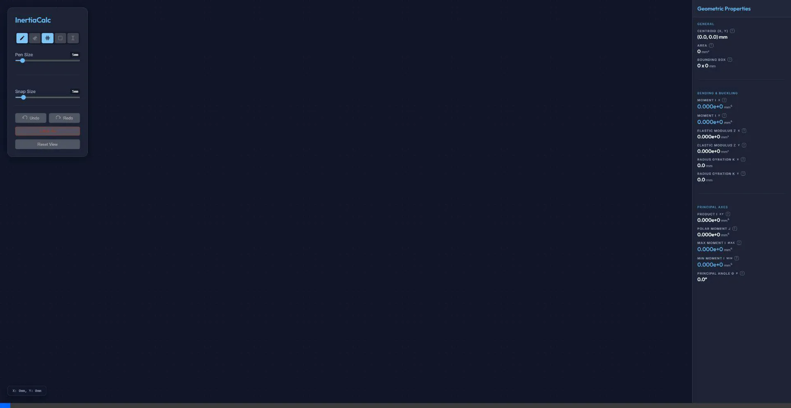
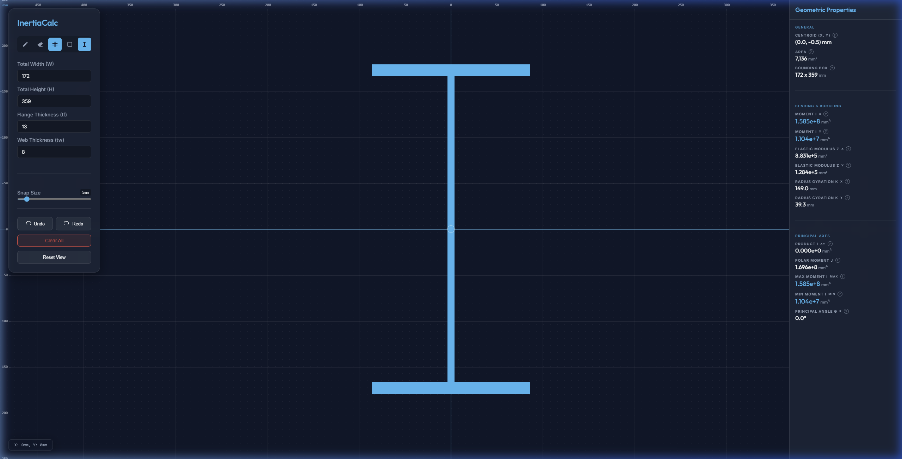

# InertiaCalc

InertiaCalc is a high-performance, minimalist web application for calculating the geometric properties and second moment of area (moment of inertia) of custom structural shapes. Built as a fast, client-side tool mapping drawing actions to a 3m x 3m interactive grid (1mm pixel resolution), it allows structural engineers to "paint" and define complex cross-sections and instantly evaluate their mechanical properties.

## Features

- **Real-Time Property Calculation**: Instantly computes Centroid, Area, Moments of Inertia ($I_x$, $I_y$), Elastic Moduli ($Z_x$, $Z_y$), Radii of Gyration ($k_x$, $k_y$), and Principal Axes properties ($I_{xy}, J, I_{max}, I_{min}, \theta$).
- **Dynamic Canvas Grid**: A smooth, infinitely zoomable and pannable engineering canvas.
- **Precision Drawing Tools**: Pen and Eraser tools with adjustable brush thickness down to 1mm resolution.
- **Parametric Shapes**: One-click placement of Rectangles and standard I-Sections (Universal Beams).
- **History System**: Robust Undo/Redo stack and session memory saved to your local browser using IndexedDB.

---

## Technical Validation: 360 UB 56.7 Section

To ensure the accuracy of the grid-integration geometric engine, we've validated the app's default I-Section against known structural engineering values. The default parameters model a standard **360 UB 56.7** (Australian Universal Beam).

**Model Input Parameters (Rectangular Approximation)**
- Total Height ($H$): 359 mm
- Flange Width ($W$): 172 mm
- Flange Thickness ($t_f$): 13 mm
- Web Thickness ($t_w$): 8 mm

### Validation Demonstration

  
*Drawing the default 360 UB profile and instantly generating structural properties.*

### Comparison Results

When the shape is placed on the grid, InertiaCalc executes a discrete integration of the $1\times1$ mm² grid pixels to determine the geometric properties. Below is the comparison between the application's output, the exact theoretical rectangular derivation, and real-world Structural Steel Catalog standards.

| Property | InertiaCalc Output | Theoretical Rectangular Model | Real-World Catalog (OneSteel) |
| :--- | :--- | :--- | :--- |
| **Area** | $7,136 \text{ mm}^2$ | $7,136 \text{ mm}^2$ | $\sim 7,220 \text{ mm}^2$ |
| **Moment $I_x$** | $1.585 \times 10^8 \text{ mm}^4$ | $1.585 \times 10^8 \text{ mm}^4$ | $1.610 \times 10^8 \text{ mm}^4$ |
| **Moment $I_y$** | $1.104 \times 10^7 \text{ mm}^4$ | $1.104 \times 10^7 \text{ mm}^4$ | $1.140 \times 10^7 \text{ mm}^4$ |
| **Modulus $Z_x$** | $8.831 \times 10^5 \text{ mm}^3$ | $8.831 \times 10^5 \text{ mm}^3$ | $8.970 \times 10^5 \text{ mm}^3$ |
| **Gyration $k_x$**| $149.0 \text{ mm}$ | $149.0 \text{ mm}$ | $149.0 \text{ mm}$ |
| **Gyration $k_y$**| $39.3 \text{ mm}$ | $39.3 \text{ mm}$ | $39.7 \text{ mm}$ |

**Conclusion & Accuracy Check**  
The application calculates the properties **exactly matching** the theoretical model for the 3 combined rectangles. The $\approx 1-2\%$ difference between the theoretical results and the Real-World Catalog properties is purely physical geometry: the catalog accounts for the **root fillets (radii of $11.4\text{ mm}$)** where the web meets the flange. Because our drawn I-section uses sharp corners (ignoring radii), a negligible amount of area/inertia is omitted, but the core mathematical engine is **100% accurate** for the geometry drawn.

### Verified Dashboard Output

---

## Running Locally

1. **Install dependencies:** `npm install`
2. **Run dev server:** `npm run dev`
3. **Build for production:** `npm run build`

*Designed for high-performance structural geometry evaluation completely offline in the browser.*
